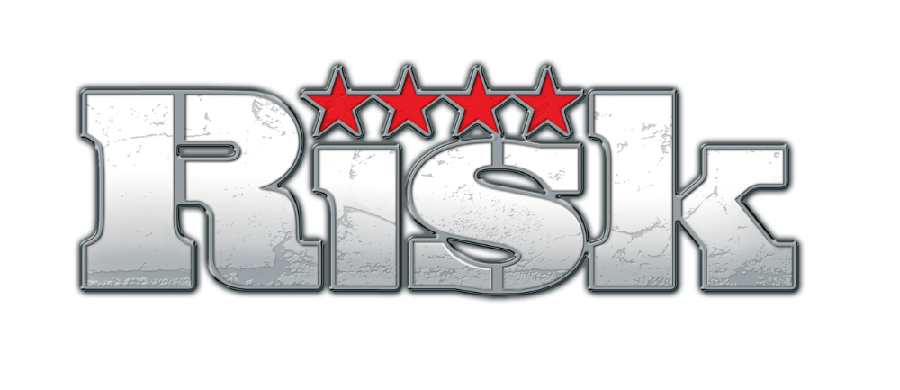

  

# RISK – Missions Management

The aim of this small application is that you can distribute mission cards among all players over the web.

## Requirements

1. No mission card is distributed twice
2. Mission cards are secret
3. As long as a user is online no second login is possible
4. Offline users will be deleted on action “New Game”
5. If a game has started, new players get automatically a mission card
